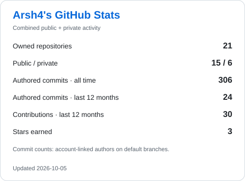
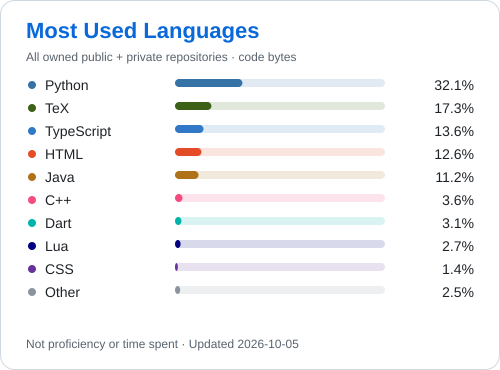

# ⭐About:

  <picture>
    <source media="(prefers-color-scheme: dark)" srcset="profile/hello-dark.svg">
    <source media="(prefers-color-scheme: light)" srcset="profile/hello-light.svg">
    
  </picture>

### ⭐I'm a Computer Engineering student, and during my free time I enjoy programming and working on projects that help me learn and explore different aspects of software development. I also enjoy working on projects that align with my personal interests, i.e., iPhone and Android apps, videogames, YouTube, ect.

### 📬Email: newarsha@gmail.com

 

# 📊 GitHub activity

  <picture>
    <source media="(prefers-color-scheme: dark)" srcset="profile/stats-dark.svg">
    <source media="(prefers-color-scheme: light)" srcset="profile/stats-light.svg">
    
  </picture>
  <picture>
    <source media="(prefers-color-scheme: dark)" srcset="profile/languages-dark.svg">
    <source media="(prefers-color-scheme: light)" srcset="profile/languages-light.svg">
    
  </picture>

Language share is based on code bytes, not proficiency. Commit totals use my
account-linked commits on owned repositories' default branches.
[How these cards are generated and refreshed](docs/profile-stats.md).

# 🎗️Skills:

<!-- SKILLS:START -->
### Languages

### Frameworks, data & tooling

Based on committed languages and dependency/configuration manifests across my public and private projects. Language detection may include documentation and scaffolding; it is not a proficiency ranking.

<!-- SKILLS:END -->

# ℹ️Socials:

 
